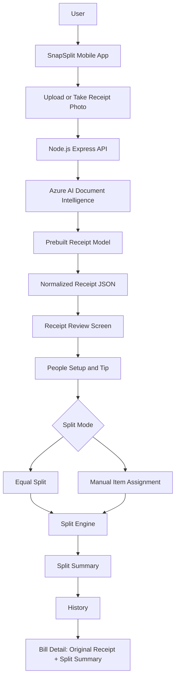

# SnapSplit

SnapSplit is a mobile receipt-splitting app for group dinners. It helps users upload or take a receipt photo, extract receipt data with Azure AI Document Intelligence, review and edit the detected items, add people, split items manually or equally, add tips, and save a clear split summary to history.

## Problem

Splitting a restaurant bill with friends is often annoying and unfair. People order different items, some dishes are shared, tips need to be included, and one person usually has to manually calculate who owes what.

SnapSplit solves this by turning the whole process into a simple mobile flow.

## Solution

SnapSplit lets users:

* upload or take a receipt photo;
* extract receipt information using Azure AI Document Intelligence;
* review and edit the detected receipt items;
* edit the restaurant name if it was not detected correctly;
* add people to the split;
* use emoji avatars and unique colors for each person;
* add a tip;
* split the bill equally or manually;
* assign items to one or more people;
* save the original receipt and final split summary;
* view previous bills in History;
* delete saved bills with long press.

## Features

### Mobile app

* Expo React Native mobile app
* Clean SnapSplit UI
* Home screen with recent bills
* Receipt upload / take picture flow
* Azure AI receipt parsing
* Demo receipt fallback
* Editable receipt review
* Editable restaurant name
* Editable item name, price, and quantity
* People setup
* Random emoji avatars
* Unique person colors
* Tip support
* Equal split mode
* Manual split mode
* Item assignment to one or multiple people
* Visual color markers for assigned items
* Split summary by person
* Pretty receipt summary
* History screen
* Bill detail screen with original receipt and split summary
* Long press delete for saved bills

### Backend API

* Node.js Express backend
* Azure AI Document Intelligence integration
* Receipt image upload with multipart form data
* Normalized receipt parsing response
* Fallback behavior if Azure cannot detect structured items
* Health check endpoint

## Tech Stack

### Mobile

* Expo
* React Native
* TypeScript
* Expo Image Picker
* Expo Sharing / Media tools
* Local state and local history persistence

### Backend

* Node.js
* Express
* Multer
* CORS
* dotenv
* Azure AI Document Intelligence REST API

### AI

* Azure AI Document Intelligence
* Prebuilt receipt model: `prebuilt-receipt`

### Development

* VS Code
* GitHub Copilot
* GitHub Copilot Agent mode

## Project Structure

```text
snapsplit-mobile-v5/
├── api/
│   ├── index.js
│   ├── package.json
│   ├── package-lock.json
│   ├── .env.example
│   └── .gitignore
│
├── mobile/
│   ├── App.tsx
│   ├── app.json
│   ├── package.json
│   ├── package-lock.json
│   ├── tsconfig.json
│   └── src/
│       ├── components/
│       ├── data/
│       ├── logic/
│       ├── screens/
│       ├── theme.ts
│       └── types.ts
│
├── docs/
│   └── architecture.md
│
├── README.md
└── .gitignore
```

## How It Works

```text
User uploads receipt
        ↓
Mobile app sends image to API
        ↓
API sends receipt to Azure AI Document Intelligence
        ↓
Azure extracts receipt text and fields
        ↓
API normalizes restaurant name, items, prices, quantities, and totals
        ↓
Mobile app opens editable Receipt Review screen
        ↓
User confirms receipt and adds people
        ↓
User chooses equal or manual split
        ↓
App calculates who owes what
        ↓
Final split is saved to History
```

## Architecture



## Setup

### Prerequisites

* Node.js
* npm
* Expo Go on iPhone or Android
* Azure account
* Azure AI Document Intelligence resource

## API Setup

Go to the API folder:

```bash
cd api
npm install
```

Create a `.env` file inside the `api/` folder:

```env
AZURE_DOCUMENT_INTELLIGENCE_ENDPOINT=your_azure_endpoint_here
AZURE_DOCUMENT_INTELLIGENCE_KEY=your_azure_key_here
PORT=3000
```

Do not commit `.env` to GitHub.

Start the API server:

```bash
npm start
```

The API should run on:

```text
http://localhost:3000
```

Health check:

```text
http://localhost:3000/health
```

## Mobile Setup

Open a second terminal and go to the mobile folder:

```bash
cd mobile
npm install
```

Start Expo:

```bash
npx expo start --clear
```

On Windows PowerShell, use:

```powershell
npx.cmd expo start --clear
```

Scan the QR code with Expo Go.

## Important Local Network Note

When testing on a physical phone, the phone cannot use `localhost` to reach the API. The mobile app must use the computer’s local network IP address, for example:

```text
http://192.168.x.x:3000/api/parse-receipt
```

The phone and computer must be on the same Wi-Fi network.

## API Endpoints

### Health Check

```http
GET /health
```

### Parse Receipt

```http
POST /api/parse-receipt
```

Expected form-data field:

```text
receipt
```

Returns normalized receipt data:

```json
{
  "restaurantName": "Bella Napoli",
  "date": "2026-06-14",
  "items": [
    {
      "name": "Pasta Carbonara",
      "price": 12.5,
      "quantity": 1
    }
  ],
  "subtotal": 12.5,
  "tax": 0,
  "tip": 0,
  "total": 12.5
}
```

## Demo Flow

1. Open SnapSplit.
2. Tap **Split Bill**.
3. Upload or take a receipt photo.
4. Azure AI extracts receipt information.
5. Review and edit detected receipt items.
6. Edit restaurant name if needed.
7. Add people.
8. Choose tip.
9. Choose equal or manual split.
10. Assign receipt items to people.
11. View final split summary.
12. Save the bill to History.
13. Open History to view the original receipt and split summary.

## GitHub Copilot Usage

GitHub Copilot was used throughout the project to speed up development and improve the app.

Copilot helped with:

* creating the Expo React Native app structure;
* generating screen components;
* building the receipt review flow;
* improving TypeScript types;
* creating the split calculation logic;
* debugging Expo and React Native issues;
* creating the Node.js API backend;
* integrating Azure AI Document Intelligence;
* improving UI layout and mobile usability;
* adding local history behavior;
* preparing documentation.

All Copilot-generated code was reviewed, tested, and adjusted manually.

## Security

This repository does not include secrets.

Do not commit:

```text
api/.env
node_modules/
mobile/.expo/
API keys
Azure keys
real personal receipts
```

The repository includes `.env.example` only.

## Current Limitations

* The app currently runs through Expo Go in development mode.
* The API runs locally unless deployed to Azure App Service or another hosting provider.
* For production use, the backend should be deployed publicly and the mobile API URL should be updated.
* Receipt parsing quality depends on the receipt image clarity.
* If Azure cannot detect structured receipt items, users can still manually add or edit items.

## Future Improvements

* Deploy backend API to Azure App Service.
* Add TestFlight / production mobile build.
* Add contact-based sending.
* Add WhatsApp / Instagram sharing integrations.
* Add automatic kcal estimation.
* Add Copilot SDK assistant to explain split fairness.
* Add payment link generation.
* Add multi-currency support.

## Hackathon Summary

SnapSplit is a creative mobile app that makes group bill splitting easier and clearer. It combines a practical real-life use case with Azure AI receipt recognition, an editable receipt review flow, visual item assignment, tip support, and saved split history.

The project demonstrates how GitHub Copilot can accelerate mobile app development, backend API creation, AI integration, and product iteration.
