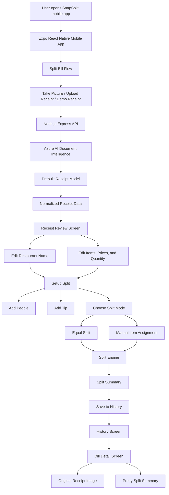

# Architecture

Mobile app: Expo React Native

Current flow:
Home -> New Bill Setup -> Assign Items -> Quick Review/Summary -> History

AI flow to add next:
Receipt Photo -> Node API -> Azure AI Document Intelligence -> Parsed items -> Mobile app

Copilot SDK flow to add later:
Split results -> Backend Copilot SDK agent -> Explain split / generate payment message / detect unfair split

# SnapSplit Architecture

## Data Flow

1. The user uploads or takes a receipt photo.
2. The mobile app sends the image to the Node.js API.
3. The API sends the receipt to Azure AI Document Intelligence.
4. Azure extracts receipt information using the prebuilt receipt model.
5. The app opens the editable Receipt Review screen.
6. The user confirms or edits restaurant name, items, prices, and quantities.
7. The user adds people, tip, and chooses split mode.
8. SnapSplit calculates the final amount per person.
9. The final split is saved to History with the original receipt and split summary.
